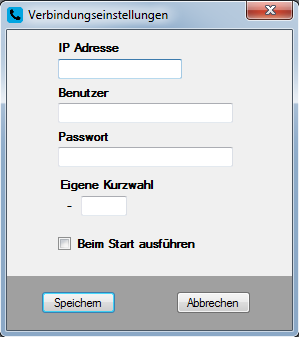
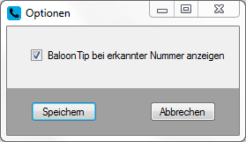
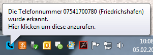
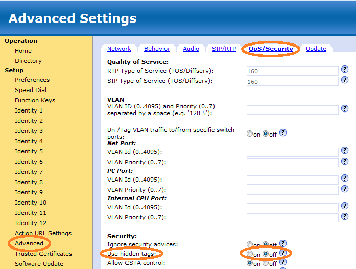

# Snom Clipboard Manager

Mit dem Snom Clipboard Manager wird das Telefonieren vereinfacht. 
Durch dieses, von [doubleSlash](https://www.doubleslash.de/), entwickelte Tool können alle Rufnummern ganz bequem durch das Kopieren in die Zwischenablage vom PC aus gewählt werden. 
Egal ob es sich dabei um eine lange externe oder um eine dreistellige interne Nummer handelt. 

Voraussetzung ist ein Snom Telefon der Modellreihe 3xx, 7xx oder 8xx, welches über das Netzwerk erreichbar sein muss.

Eine Beschreibung zur Bedienung dieses Tools, gibt es in diesem Blogpost [Link folgt].

# Setup Projekt

Zur Verwendung des Setup Projektes wird [diese Erweiterung für Visual Studio](https://marketplace.visualstudio.com/items?itemName=VisualStudioProductTeam.MicrosoftVisualStudio2015InstallerProjects) benötigt.

# API
Für weitere Änderungen an diesem Projekt, kann diese [API](http://wiki.snom.com/FAQ/Can_I_control_my_snom_phone_remotely) von Snom verwendet werden.

# Einrichtung des SnomCliM
Beim erstmaligen Start, öffnet sich ein Fenster (Abb.1), in dem man seine Nutzerdaten eingeben muss, um sich mit dem Telefon zu verbinden.

Abb.1

(Dieses Fenster kann später auch noch über das Menü aufgerufen werden, um die Einstellungen zu ändern)
Diese Informationen befinden sich im Snom-Telefon unter Settings->Netzwerk:
+	Im Menüpunkt IP Adresse kann diese abgerufen werden.
+	Der Benutzer kann im Menüpunkt HTTP Admin eingestellt werden oder über das Webinterface (http://<IP Adresse>/advanced_qos_security.htm -> HTTP-Server -> User).
+	Das Passwort kann im Menüpunkt HTTP Password eingestellt werden oder über das Webinterface (http://<IP Adresse>/advanced_qos_security.htm -> HTTP-Server -> Password).
+	Die eigene Kurzwahl muss nicht in einem Untermenü gesucht werden, sondern wir einem direkt auf dem Startbildschirm des Snom-Telefons angezeigt.
+	Bei der Checkbox lässt sich noch einstellen, ob der Clipboard Manager direkt beim Hochfahren des PCs gestartet werden soll.
+	Über den Button „Speichern“ wird nun eine Verbindung mit dem Telefon hergestellt. Stimmt etwas mit den Eingabedaten nicht, bekommt man dementsprechend eine Fehlermeldung mit der passenden Nachricht.

Nachdem sich dieses Menü geschlossen hat, befindet sich ein neues TrayIcon in der TaskBar (Abb.2):

Abb.2

Durch einen Rechts- oder Links-klick auf dieses TrayIcon öffnet sich ein Menü wie in Abb.3:

Abb.3

Von hier aus lässt sich das Programm beenden, das bekannte Einstellungsfenster oder das Optionsfenster öffnen.
Unter Optionen kann man einstellen, ob beim kopieren oder ausschneiden einer Telefonnummer oder internen Nummer ein BalloonTip angezeigt werden soll.

Abb.4

Ist diese Option aktv, so wird die Nummer beim kopieren/ausschneiden wie in Abb. 5 oder Abb.6 angezeigt:

(Interne Nummer)

Abb.5

(Externe Nummer)

Abb.6

Durch einen Klick auf den BaloonTip kann die Nummer über das Snom-Telefon angerufen werden.
Nachdem der BalloonTip verschwunden ist, befindet sich auch ein neuer Menüpunkt (Abb.7) im Menü, über diesen der Anruf getätigt werden kann:

Abb.7

# Bedienung des SnomCliM

Beim Kopieren oder Ausschneiden einer Telefonnummer oder internen Nummer erscheint wie oben beschrieben ein BalloonTip und ein neuer Menüpunkt wird hinzugefügt.
Klickt man auf diesen BaloonTip oder den ... anrufen-Button im Menü, so erhält man je nach dem eine der beiden Meldungen wie in Abb.8 oder Abb.9:

(Interne Nummer)

Abb.8

(Externe Nummer)

Abb.9

Über die Meldung wie in Abb.9 hat man entweder die Option bei der Nummer anzurufen oder bei externen Nummern eine Rückwärtssuche im Browser durchzuführen.

# "Telefon kann nicht erreicht werden"-Problem beheben.

Es kann vorkommen, dass beim Telefon das Kontaktieren über http nur über die offizielle Weboberfläche und nicht über externe Tools erlaubt ist.

Um in diesem Fall das Telefon kontaktieren zu können, müssen folgende Schritte über das Webinterface unternommen werden:

+	Im Browser, die IP Adresse des Telefons eingeben, um auf die Weboberfläche zu kommen.
+	Auf der Weboberfläche unter Advanced->QoS/Security die Option Use hidden tags auf off stellen und speichern (Abb.10).

Abb.10

